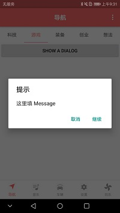
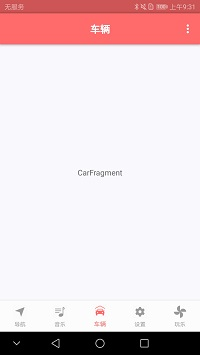

# BuzzerBeater
市面常用的界面框架，底部导航，首页导航，懒加载切换等，详情请查看图片
**初心为鉴，时间为证。**

<b>图片展示</b>

目前已完成的功能模块有：

 - 主页底部 BottomNavagation 搭建

 - 搜索页 TabLayout + Fragment 搭建

 - Fragment 的懒加载

 - Toolbar 的简单封装

 - BaseRecycleAdapter 处理条目的点击事件

 - Android 6.0 运行时权限封装

 - CommonDialogFragment 全局封装管理 Dialog
